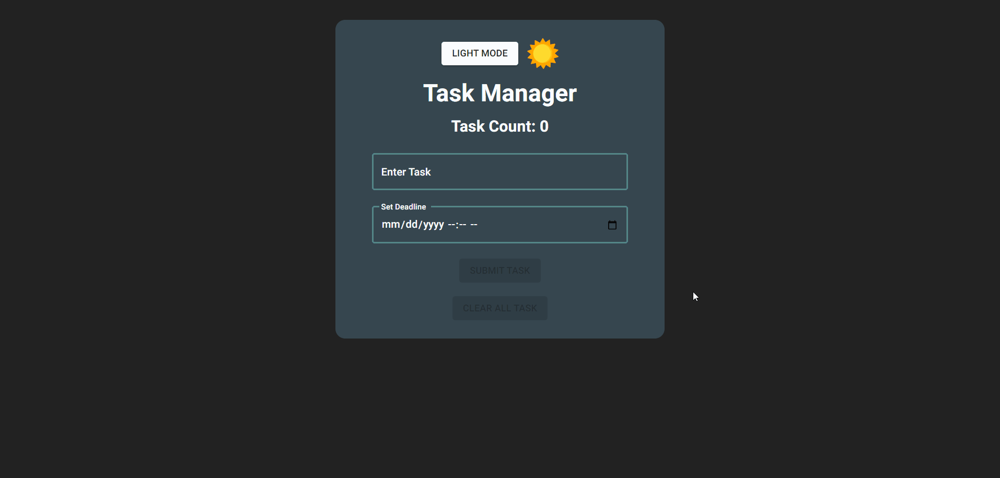
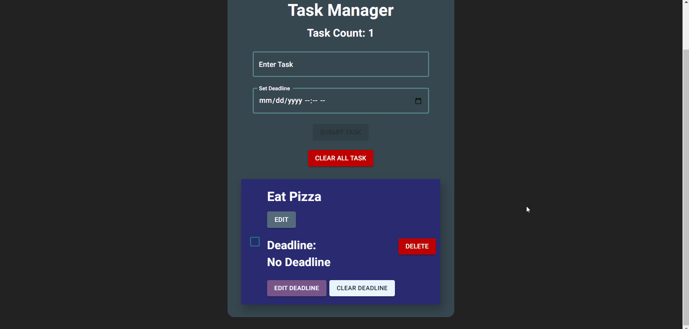
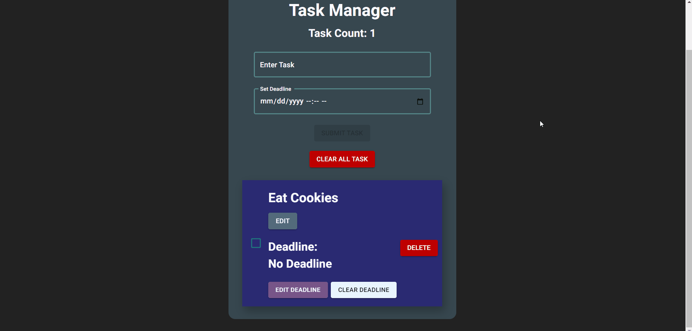
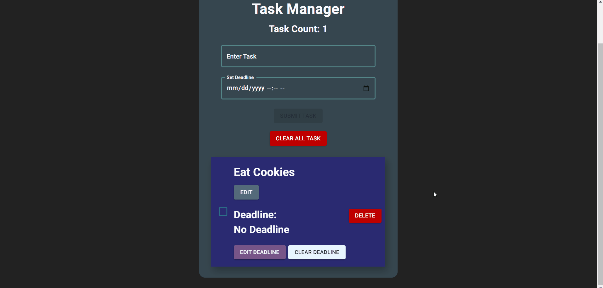
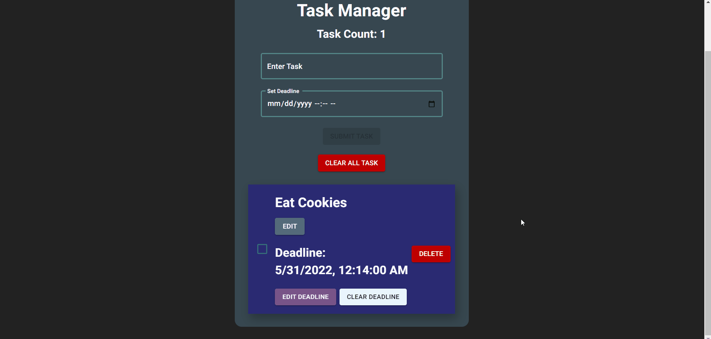

# Task Manager

A simple to-do list app where you can add, update and delete tasks. You can also set the desired deadline of each tasks. The purpose of this project is to learn how React Hooks and to increase my overall knowledge of React.

[You can visit the website here.](very-simple-task-manager.vercel.app)

 

## Features
**You can Add Tasks to the list**

 

**Update Tasks**

 

**Delete Tasks**

 

**Set Deadline of the Desired Task**

 

**Clear Deadline**

